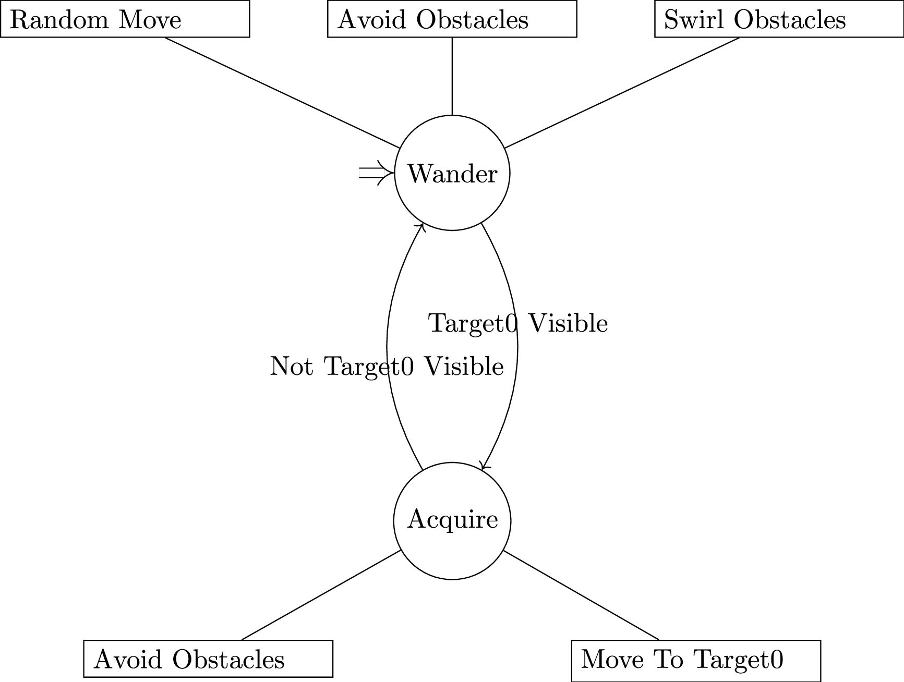
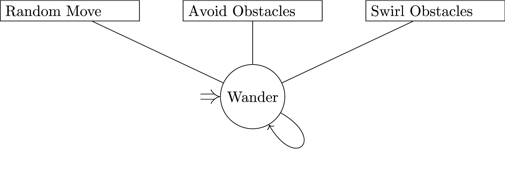

# Forage

简单的机器人围捕与逃脱策略

|Type|Class No.|
|----|---------|
|forage|2      |
|escape|0      |

## Strategy

### com.github.hy.simple

#### Forage

<!-- ```latex {cmd=true}
\documentclass[UTF8]{standalone}
\usepackage[margin=1in]{geometry}
\usepackage{fancyhdr,hyperref,xcolor,amsmath,float,graphicx,cancel}
\usepackage{tikz}
\usetikzlibrary{positioning}
\usetikzlibrary{automata}
\usetikzlibrary{arrows.meta}
\begin{document}
\begin{tikzpicture}
[every initial by arrow/.style={double distance = 3,-Implies}]
\node[state,initial,initial text=]  (Wander)  {Wander};
\node[state]  (Acquire) [below=3 of Wander] {Acquire};

\node[rectangle,draw]  (Avoid-Obstacles0) [above= of Wander,text width=3cm] {Avoid Obstacles};
\node[rectangle,draw]  (Noise0) [left= of Avoid-Obstacles0,text width=3cm] {Random Move};
\node[rectangle,draw]  (Swirl-Obstacles-Noise0) [right= of Avoid-Obstacles0,text width=3cm] {Swirl Obstacles};

\node[rectangle,draw]  (Avoid-Obstacles1) [below left= of Acquire,text width=3cm] {Avoid Obstacles};
\node[rectangle,draw]  (MS-MOVE-TO-Target0) [below right= of Acquire,text width=3cm] {Move To Target0};

\path [->] (Wander) edge [bend left] node[left, above] {Target0 Visible} (Acquire)
(Acquire) edge [bend left] node[right, below] {Not Target0 Visible} (Wander);

\path [-] (Wander) edge (Avoid-Obstacles0)
edge (Noise0)
edge (Swirl-Obstacles-Noise0);

\path [-] (Acquire) edge (Avoid-Obstacles1)
edge (MS-MOVE-TO-Target0);

\end{tikzpicture}
\end{document}
``` -->



#### Escape

<!-- ```latex {cmd=true}
\documentclass[UTF8]{standalone}
\usepackage[margin=1in]{geometry}
\usepackage{fancyhdr,hyperref,xcolor,amsmath,float,graphicx,cancel}
\usepackage{tikz}
\usetikzlibrary{positioning}
\usetikzlibrary{automata}
\usetikzlibrary{arrows.meta}
\begin{document}
\begin{tikzpicture}
[every initial by arrow/.style={double distance = 3,-Implies}]
\node[state,initial,initial text=]  (Wander)  {Wander};

\node[rectangle,draw]  (Avoid-Obstacles0) [above= of Wander,text width=3cm] {Avoid Obstacles};
\node[rectangle,draw]  (Noise0) [left= of Avoid-Obstacles0,text width=3cm] {Random Move};
\node[rectangle,draw]  (Swirl-Obstacles-Noise0) [right= of Avoid-Obstacles0,text width=3cm] {Swirl Obstacles};

\path [->] (Wander) edge [out=330,in=300,looseness=8] (Wander);

\path [-] (Wander) edge (Avoid-Obstacles0)
edge (Noise0)
edge (Swirl-Obstacles-Noise0);

\end{tikzpicture}
\end{document}
``` -->


