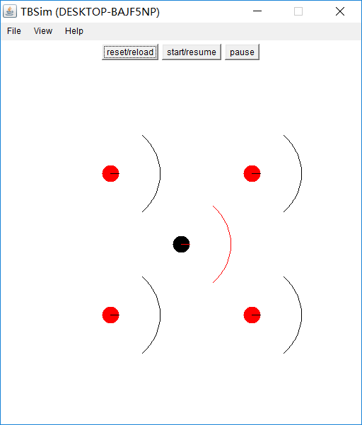
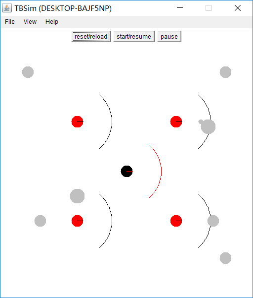
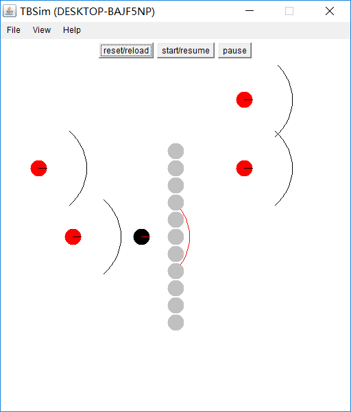
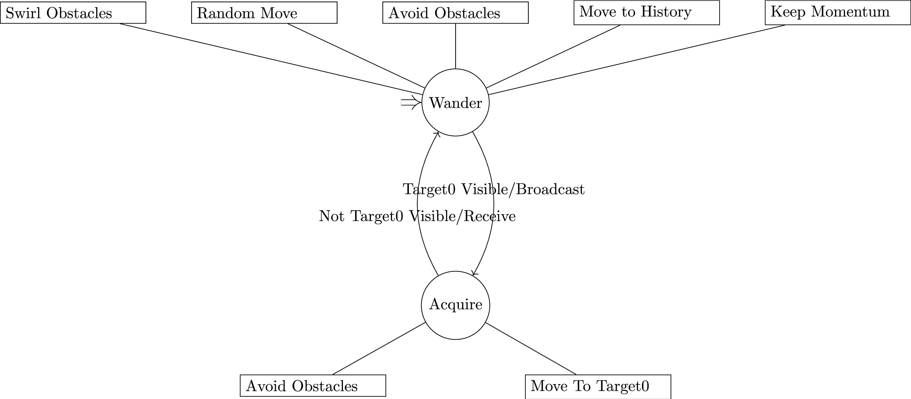
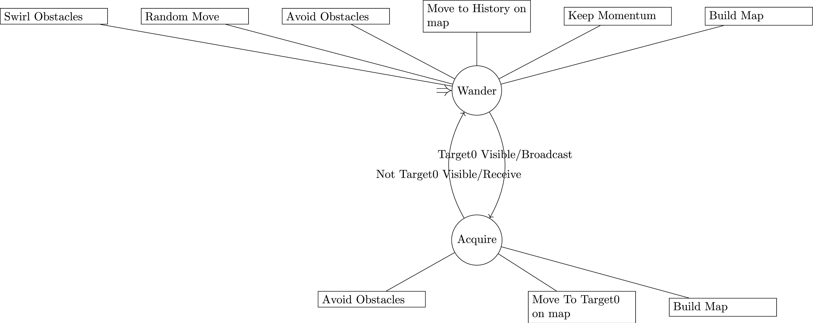
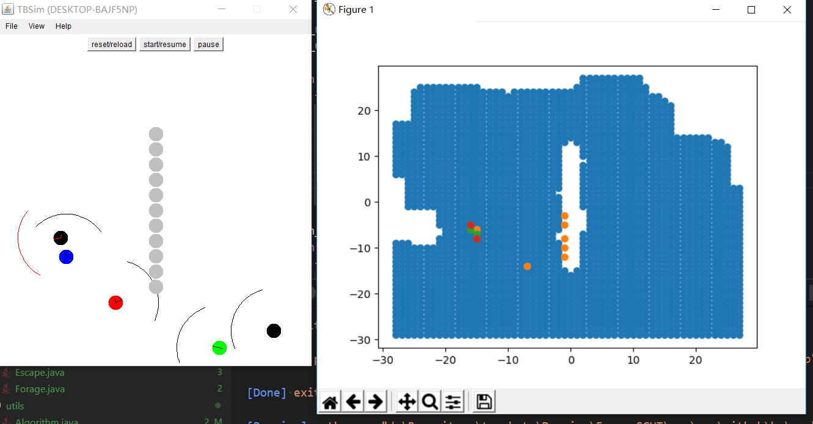
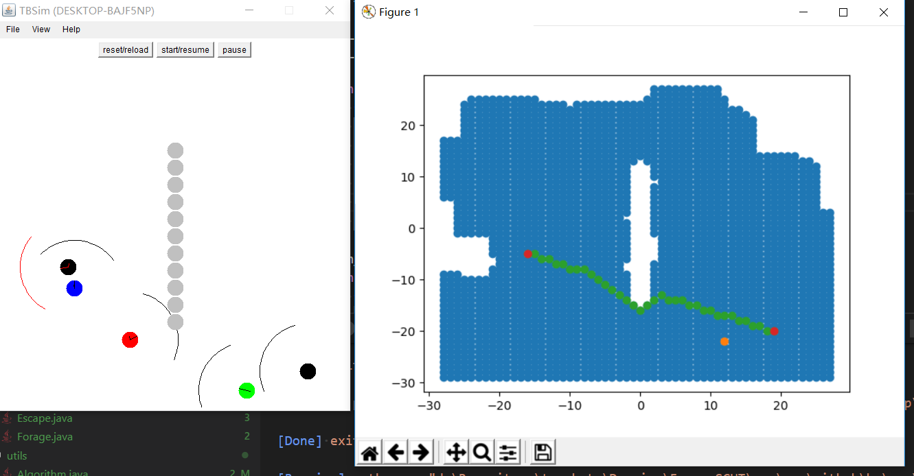
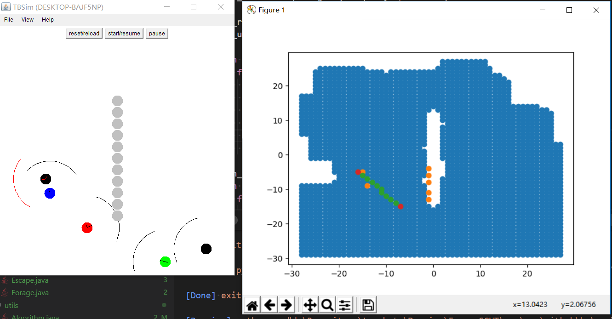

# Forage

简单的机器人围捕与逃脱策略

|Type|Class No.|
|----|---------|
|forage|2      |
|escape|0      |

## Run

```bash
# run.py -f <forage_class> -e <escape_class> -t <template_file>
python run.py -f com.github.hy.simple.Forage -e com.github.hy.simple.Escape -t forage_without_obstacles.dsc.template
python run.py -f com.github.hy.broadcast.ForageBroadcast -e com.github.hy.simple.Escape -t forage.dsc.template
python run.py -f com.github.hy.map.ForageMap -e com.github.hy.simple.Escape -t forage.2.dsc.template
```

## Map

### forage_without_obstacles.dsc.template



### forage.dsc.template



### forage.2.dsc.template



## Environment

1. teambots simulator
    使用 teambots 作为本次实验的环境模拟
2. 使用 `MultiForageN150` 作为我们的实验机器人
    它包含 `VisualObjectSensor`, `GripperActuator`, `KinSensor`, `Transceiver`
    ```java
    public interface MultiForageN150 extends SimpleN150,
        VisualObjectSensor, GripperActuator, KinSensor, Transceiver{
        //...
    }
    ```
3. $V_{Forage} < V_{Escape}$
    假设围捕机器人的速度小于被围捕者
    ```java
    abstract_robot.setBaseSpeed(0.5 * abstract_robot.MAX_TRANSLATION); //Forage
    abstract_robot.setBaseSpeed(abstract_robot.MAX_TRANSLATION); //Escape
    ```
4. 采用人工势场法来决定每一步的动作
    每一步移动时, 根据所提供的向量来决定每一步移动的角度
    ```java
    result = steering_configuration.Value(curr_time);
    abstract_robot.setSteerHeading(curr_time, result.t);
    abstract_robot.setSpeed(curr_time, result.r > 0 ? 1.0 : 0.0);
    ```

## Strategy

### com.github.hy.simple

#### Forage

<!-- ```latex {cmd=true}
\documentclass[UTF8]{standalone}
\usepackage[margin=1in]{geometry}
\usepackage{fancyhdr,hyperref,xcolor,amsmath,float,graphicx,cancel}
\usepackage{tikz}
\usetikzlibrary{positioning}
\usetikzlibrary{automata}
\usetikzlibrary{arrows.meta}
\begin{document}
\begin{tikzpicture}
[every initial by arrow/.style={double distance = 3,-Implies}]
\node[state,initial,initial text=]  (Wander)  {Wander};
\node[state]  (Acquire) [below=3 of Wander] {Acquire};

\node[rectangle,draw]  (Avoid-Obstacles0) [above= of Wander,text width=3cm] {Avoid Obstacles};
\node[rectangle,draw]  (Noise0) [left= of Avoid-Obstacles0,text width=3cm] {Random Move};
\node[rectangle,draw]  (Swirl-Obstacles-Noise0) [right= of Avoid-Obstacles0,text width=3cm] {Swirl Obstacles};

\node[rectangle,draw]  (Avoid-Obstacles1) [below left= of Acquire,text width=3cm] {Avoid Obstacles};
\node[rectangle,draw]  (MS-MOVE-TO-Target0) [below right= of Acquire,text width=3cm] {Move To Target0};

\path [->] (Wander) edge [bend left] node[left, above] {Target0 Visible} (Acquire)
(Acquire) edge [bend left] node[right, below] {Not Target0 Visible} (Wander);

\path [-] (Wander) edge (Avoid-Obstacles0)
edge (Noise0)
edge (Swirl-Obstacles-Noise0);

\path [-] (Acquire) edge (Avoid-Obstacles1)
edge (MS-MOVE-TO-Target0);

\end{tikzpicture}
\end{document}
``` -->


1. 只有两个状态, 一个是 `Wander`, 一个是 `Acquire`
    初始为 `Wander`, 当发现 `Visual Class` 为 `2` 的目标(`Target0`)是, 切换到 `Acquire` 状态.
    ```java
    // ======
    // STATE_MACHINE
    // ======
    STATE_MACHINE = new i_FSA_ba();

    STATE_MACHINE.state = 0;
    // STATE 0 WANDER
    STATE_MACHINE.triggers[0][0] = PF_TARGET0_VISIBLE; // 是否发现目标
    STATE_MACHINE.follow_on[0][0] = 1; // transition to ACQUIRE0

    // STATE 1 ACQUIRE0
    STATE_MACHINE.triggers[1][0] = PF_NOT_TARGET0_VISIBLE;
    STATE_MACHINE.follow_on[1][0] = 0; // transition to WANDER
    ```

2. 在 `Wander` 状态, 主要有3个动作:
    ```java
    AS_WANDER.weights[0] = 1.0;
    AS_WANDER.embedded[0] = MS_AVOID_OBSTACLES; // 避开障碍

    AS_WANDER.weights[1] = 1.0;
    AS_WANDER.embedded[1] = MS_NOISE_VECTOR; // 随机移动

    AS_WANDER.weights[2] = 1.0;
    AS_WANDER.embedded[2] = MS_SWIRL_OBSTACLES_NOISE; // 随机旋转
    ```

    1. 随机移动
    设定一个时间, 当超过时间后改变方向
        ```java
        if (accum > TIMEOUT){
            accum = 0;
            last_val.sett(r.nextDouble()*2*Math.PI);
        }
        ```

    2. 避障
        在影响范围内, 产生一个与目标连线相反的排斥向量, 当靠得特别近时, 产生一个超级大的向量以避免发生碰撞
        ```java
        /*--- too close ? ---*/
        if (obs[i].r < safety)
            {
            tempmag = -1*Units.HUGE;
            }
        /*--- controlled zone ---*/
        else if (obs[i].r < sphere)
            tempmag =
                -1*(sphere - obs[i].r)/
                (sphere - safety);
        /*--- outside sphere ---*/
        else tempmag = 0;

        /*--- set the repulsive vector ---*/
        obs[i].setr(tempmag);
        ```

    3. 绕着障碍物移动
        当在障碍物的影响范围内, 会产生一个垂直 与目标连线的向量
        ```java
        // inside saftey zone, set full magnitude
        if (obs[i].r < safety)
            {
            tempmag = 1;
            }
        // in controlled zone
        else if (obs[i].r < sphere)
            tempmag = (sphere - obs[i].r)/
                (sphere - safety);
        // outside sphere of influence, ignore
        else tempmag = 0;
        obs[i].setr(tempmag);

        tempdir = -Units.BestTurnRad(refheading,obs[i].t);

        if (tempdir < 0)
            obs[i].sett(obs[i].t - Math.PI/2);
        else
            obs[i].sett(obs[i].t + Math.PI/2);
        last_val.add(obs[i]);
        ```

#### Escape

<!-- ```latex {cmd=true}
\documentclass[UTF8]{standalone}
\usepackage[margin=1in]{geometry}
\usepackage{fancyhdr,hyperref,xcolor,amsmath,float,graphicx,cancel}
\usepackage{tikz}
\usetikzlibrary{positioning}
\usetikzlibrary{automata}
\usetikzlibrary{arrows.meta}
\begin{document}
\begin{tikzpicture}
[every initial by arrow/.style={double distance = 3,-Implies}]
\node[state,initial,initial text=]  (Wander)  {Wander};

\node[rectangle,draw]  (Avoid-Obstacles0) [above= of Wander,text width=3cm] {Avoid Obstacles};
\node[rectangle,draw]  (Noise0) [left= of Avoid-Obstacles0,text width=3cm] {Random Move};
\node[rectangle,draw]  (Swirl-Obstacles-Noise0) [right= of Avoid-Obstacles0,text width=3cm] {Swirl Obstacles};

\path [->] (Wander) edge [out=330,in=300,looseness=8] (Wander);

\path [-] (Wander) edge (Avoid-Obstacles0)
edge (Noise0)
edge (Swirl-Obstacles-Noise0);

\end{tikzpicture}
\end{document}
``` -->


1. `Escape` 只有一个 `Wander` 状态
2. `Wander` 状态有3个动作
    1. 随机移动
    2. 避障
    3. 绕障碍物平面移动

### com.github.hy.broadcast

#### ForageBroadcast

<!-- ```latex {cmd=true}
\documentclass[UTF8]{standalone}
\usepackage[margin=1in]{geometry}
\usepackage{fancyhdr,hyperref,xcolor,amsmath,float,graphicx,cancel}
\usepackage{tikz}
\usetikzlibrary{positioning}
\usetikzlibrary{automata}
\usetikzlibrary{arrows.meta}
\begin{document}
\begin{tikzpicture}
[every initial by arrow/.style={double distance = 3,-Implies}]

\node[state,initial,initial text=]  (Wander)  {Wander};
\node[state]  (Acquire) [below=3 of Wander] {Acquire};

\node[rectangle,draw]  (Avoid-Obstacles0) [above= of Wander,text width=3cm] {Avoid Obstacles};
\node[rectangle,draw]  (HISTORY0) [right= of Avoid-Obstacles0,text width=3cm] {Move to History};

\node[rectangle,draw]  (Noise0) [left= of Avoid-Obstacles0,text width=3cm] {Random Move};
\node[rectangle,draw]  (Swirl-Obstacles-Noise0) [left= of Noise0,text width=3cm] {Swirl Obstacles};

\node[rectangle,draw]  (Momentum0) [right= of HISTORY0,text width=3cm] {Keep Momentum};

\node[rectangle,draw]  (Avoid-Obstacles1) [below left= of Acquire,text width=3cm] {Avoid Obstacles};
\node[rectangle,draw]  (MS-MOVE-TO-Target0) [below right= of Acquire,text width=3cm] {Move To Target0};

\path [->] (Wander) edge [bend left] node[left, above] {Target0 Visible/Broadcast} (Acquire)
(Acquire) edge [bend left] node[right, below] {Not Target0 Visible/Receive} (Wander);

\path [-] (Wander) edge (Avoid-Obstacles0)
edge (Noise0)
edge (Swirl-Obstacles-Noise0)
edge (HISTORY0)
edge (Momentum0);

\path [-] (Acquire) edge (Avoid-Obstacles1)
edge (MS-MOVE-TO-Target0);

\end{tikzpicture}
\end{document}
``` -->



1. 在 `Simple` 的基础上, 增加了3个能力, 一个是 广播 `broadcast` 的能力, 一个是记录历史位置信息, 并向其中移动的能力, 最后一个则是动量保持(向原来的运动方向继续移动)
2. 在 `Wander` 状态下, 接收(`Receive`) 其他同类机器人的消息
    该消息是 `PositionsMessage` 类型, 传递一组位置信息, 这些位置的含义是 `HISTORY` ( `MAP_REACHABLE`, `MAP_UNREACHABLE` 是后面地图功能所用到)
    表示发送者发现了目标, 这些目标的位置

    消息定义:
    ```java
    public PositionsMessage(Vec2[] p, PositionsMessageType message_type) {
        this.val = p;
        this.message_type = message_type;
    }
    public enum PositionsMessageType {
        HISTORY, MAP_REACHABLE, MAP_UNREACHABLE
    };
    ```

    消息广播与接收:
    ```java
    //broadcast
    int state = STATE_MACHINE.Value(curr_time);
    // BRODCAST POSITION OF TARTGET0 TO OTHER TEAMMATES
    if (state == 1) {
        Message m = new PositionsMessage(targets0_global.Value(curr_time), PositionsMessageType.HISTORY);
        abstract_robot.broadcast(m);
    }

    //receive
    messagesin = abstract_robot.getReceiveChannel();// COMMUNICATION
    while (abstract_robot.connected() && messagesin.hasMoreElements()) {
        Message msg = (Message) messagesin.nextElement();
        retList.add(msg);
    }
    ```

    向历史位置(可能来自其他人, 也可能来自自己在 `Acquire` 下的 `target`)移动:
    ```java
    AS_ACQUIRE0.weights[2] = 1.0; // 在 Acquire 下, 权重为0, 触发更新, 但不参与移动的决策
    AS_ACQUIRE0.embedded[2] = MS_MOVE_TO_HISTORY;

    //两个来源, 记录上一次历史位置信息的来源
    if (closest_cache.CheckUpdateAfter(last_update)) {
        last_r = 1;
        last_node = closest_cache;
        last_update = closest_cache.last_update;
    } else if (broadcast_cache.CheckUpdateAfter(last_update)) {
        last_r = 1;
        last_node = broadcast_cache;
        last_update = broadcast_cache.last_update;
    }
    ```

    这个历史信息不能始终影响 `Wander` 状态的移动, 这个信息有时间限制
    因此, 当超时时设置过期, 或者, 当到达目标附近的时候, 就应该展开搜索, 而不是停留在目标附近(受到这个因素的影响, 始终靠近这个位置而无法离开).
    ```java
    last_val = last_node.Value(timestamp);
    if (last_r == 0 || last_val.r < 1) {
        last_r = 0;
        return (Vec2) zero_val.clone();
    }
    if (last_r > 0.05) {
        //原本想通过 last_r 来不断削弱这个位置的影响, 但观察发现使用计次的方法一样
        //同时后面地图部分也需要准确的位置(不能setr), 所以有了这个丑陋的代码
        last_r = last_r * aging_rate;
    } else if (last_r > 0) {
        last_r = 0;
    }
    return (new Vec2(last_val.x, last_val.y));
    ```

    需要记录历史位置, 而不是实时地获取, 因此实现 `v_cache`, 始终记录上一次的信息
    此处, 记录的位置应该是全局的坐标, 相对坐标会随着移动不断发生变化
    ```java
    Vec2 pos_local_val = pos_local.Value(timestamp);
    Vec2 robot_pos_global_val = robot_pos_global.Value(timestamp);
    boolean cache_triger_val = cache_triger.Value(timestamp);
    // Cache the pos only when the pos_local_val is valid.

    if (cache_triger_val) {
        pos_local_val.add(robot_pos_global_val);
        last_val = (Vec2) pos_local_val.clone();
        last_update = timestamp;
    }
    ```

3. `Momentum` 动量保持
    返回上一次的移动向量, 同时乘以一个衰减系数以避免这个因素的持续影响
    ```java
    if (last_val.r < 1e-2) {
         last_val.setr(0);
    } else if (last_val.r > 0) {
        last_val.setr(last_val.r * agging_rate);
    }

    Vec2 ret = new Vec2(last_val.x, last_val.y);

    Vec2 src_val = src.Value(timestamp);
    last_val.add(src_val);

    return (ret);
    ```

### com.github.hy.map

#### ForageMap

<!-- ```latex {cmd=true}
\documentclass[UTF8]{standalone}
\usepackage[margin=1in]{geometry}
\usepackage{fancyhdr,hyperref,xcolor,amsmath,float,graphicx,cancel}
\usepackage{tikz}
\usetikzlibrary{positioning}
\usetikzlibrary{automata}
\usetikzlibrary{arrows.meta}
\begin{document}
\begin{tikzpicture}
[every initial by arrow/.style={double distance = 3,-Implies}]

\node[state,initial,initial text=]  (Wander)  {Wander};
\node[state]  (Acquire) [below=3 of Wander] {Acquire};


\node[rectangle,draw]  (HISTORY0) [above= of Wander,text width=3cm] {Move to History on map};
\node[rectangle,draw]  (Avoid-Obstacles0) [left= of HISTORY0,text width=3cm] {Avoid Obstacles};
\node[rectangle,draw]  (Noise0) [left= of Avoid-Obstacles0,text width=3cm] {Random Move};
\node[rectangle,draw]  (Swirl-Obstacles-Noise0) [left= of Noise0,text width=3cm] {Swirl Obstacles};

\node[rectangle,draw]  (Momentum0) [right= of HISTORY0,text width=3cm] {Keep Momentum};
\node[rectangle,draw]  (BuildingMap) [right= of Momentum0,text width=3cm] {Build Map};

\node[rectangle,draw]  (Avoid-Obstacles1) [below left= of Acquire,text width=3cm] {Avoid Obstacles};
\node[rectangle,draw]  (MS-MOVE-TO-Target0) [below right= of Acquire,text width=3cm] {Move To Target0 on map};
\node[rectangle,draw]  (BuildingMap2) [right= of MS-MOVE-TO-Target0,text width=3cm] {Build Map};

\path [->] (Wander) edge [bend left] node[left, above] {Target0 Visible/Broadcast} (Acquire)
(Acquire) edge [bend left] node[right, below] {Not Target0 Visible/Receive} (Wander);

\path [-] (Wander) edge (Avoid-Obstacles0)
edge (Noise0)
edge (Swirl-Obstacles-Noise0)
edge (HISTORY0)
edge (Momentum0)
edge (BuildingMap);

\path [-] (Acquire) edge (Avoid-Obstacles1)
edge (MS-MOVE-TO-Target0)
edge (BuildingMap2);

\end{tikzpicture}
\end{document}
``` -->



1. 增加建立地图的能力, 在机器人移动的过程中(每一个step), 记录所移动过的区域, 以及所能看到的可移动的区域
    同时, 在不同的机器人之间通过广播, 共享这一份信息

    广播与接收消息:
    ```java
    public int takeStep() {
        // CACHE ADN BROADCAST MAP POSITIONS MESSAGE
        mapControllor.collectAndBroadcastCurrentPos();
        mapControllor.updateMap(PS_REACHABLE_POSITIONS_BROADCAST.Value(curr_time), MapStatus.REACHABLE);
    }

    PS_REACHABLE_POSITIONS_BROADCAST = new va_FilterOutLastPositions(MSG_RECIEVE,
                PositionsMessageType.MAP_REACHABLE);
    ```

    增加 `MapController` 管理地图和路径规划的功能, 使用栅格法来表示地图

    感知的范围范围是一个圆, 为方便, 只把圆内正方向的区域添加到可到达的区域
    ```java
    public void collectAndBroadcastCurrentPos() {
        // the edge of square in the circle with radius min_r, which is reachable
        double a = min_r / sqrt2;

        Vec2 pos = abstract_robot.getPosition(-1);
        double l = Math.ceil((pos.x - a) / granularity) * granularity;
        double r = Math.floor((pos.x + a) / granularity) * granularity;
        double d = Math.floor((pos.y - a) / granularity) * granularity;
        double u = Math.floor((pos.y + a) / granularity) * granularity;

        for (double i = l; i <= r; i += granularity) {
            for (double j = d; j <= u; j += granularity) {
                collectAndBroadcastCurrentPos(i, j);
            }
        }

    }
    ```

    若在感知区域内存在障碍物, 则把圆的范围缩小到障碍物的边缘为止:
    ```java
    // the reachable position
    Vec2[] obstacles = abstract_robot.getObstacles(-1);
    double min_r = abstract_robot.VISION_RANGE;
    // min_r = abstract_robot.RADIUS;
    for (int i = 0; i < obstacles.length; ++i) {
        if (obstacles[i].r < min_r) {
            min_r = obstacles[i].r;
        }
    }
    ```

    先缓存一定的信息再广播, 同时只传递新增的信息

    当达到缓存满, 则广播出去, 同时更新自己的地图:
    ```java
    private void collectAndBroadcastCurrentPos(double x, double y) {
        if (pos_reachable_size >= pos_reachable_cache.length) {
            copyAndBroadcast(pos_reachable_cache, PositionsMessageType.MAP_REACHABLE);
            pos_reachable_size = 0;
        }
    }
    private void copyAndBroadcast(Vec2[] cache, PositionsMessageType message_type) {
        Vec2[] p = new Vec2[cache.length];
        for (int i = 0; i < cache.length; i++) {
            p[i] = (Vec2) cache[i].clone();
        }
        Message m = new PositionsMessage(p, message_type);
        abstract_robot.broadcast(m);
    }
    ```

    已存在的点是不必要缓存的:
    ```java
    if (sparse_map.get(convert(x), convert(y)) != MapStatus.REACHABLE) {
        pos_reachable_cache[pos_reachable_size++] = new Vec2(x, y);
        updateMap(sparse_map, x, y, MapStatus.REACHABLE);
    }
    ```

    增加粒度 `granularity`表示一个栅格的大小:
    ```java
    private int convert(double x) {
        // convert x according granularity
        return Math.toIntExact(Math.round(x / granularity));
    }
    ```

    障碍并不是固定的, 也可能是可移动的物体, 原本记录的可到达的点会被可移动的物体占领, 因此, 在决策时需要同步可观察到的障碍物的信息.
    (同时, 机器人会把我们的目标识别成障碍, 我们需要靠近它, 而不是作为障碍而避开)
    ```java
    private SparseMap<MapStatus> getRealtimeMap(Vec2 target) {
        SparseMap<MapStatus> ret = sparse_map.clone();
        Vec2[] obstacles = abstract_robot.getObstacles(-1);
        Vec2 pos = abstract_robot.getPosition(-1);

        Vec2 tmp_tar = (Vec2) target.clone();
        tmp_tar.sub(pos);

        List<Vec2> list = new ArrayList<Vec2>(obstacles.length);
        for (int i = 0; i < obstacles.length; ++i) {

            // remove the point on targets
            Vec2 tmp = (Vec2) obstacles[i].clone();
            tmp.sub(tmp_tar);
            if (tmp.r < 0.3)// tmp.r less than the radius of target (0.247), we set 0.3 here.
                continue;

            obstacles[i].add(pos);
            list.add(obstacles[i]);
        }

        obstacles = new Vec2[list.size()];
        obstacles = list.toArray(obstacles);
        updateMap(ret, obstacles, MapStatus.UNREACHABLE);
        return ret;
    }
    ```

2. 采用嵌套的map结构来存储一个稀疏的动态更新的地图
    ```java
    /*
    * SparseMap.java
    */
    package com.github.hy.utils;

    import java.io.FileWriter;
    import java.util.*;
    import java.io.*;

    public class SparseMap<T> implements Cloneable {
        Map<Integer, Map<Integer, T>> elements = new HashMap<Integer, Map<Integer, T>>();

        public void put(Integer x, Integer y, T v) {
            Map<Integer, T> row = elements.get(x);
            if (row == null) {
                elements.put(x, new HashMap<Integer, T>());
                row = elements.get(x);
            }
            row.put(y, v);
        }

        public T get(Integer x, Integer y) {
            Map<Integer, T> row = elements.get(x);
            if (row == null)
                return null;
            return row.get(y);
        }

        public int size() {
            int cnt = 0;
            for (Map.Entry<Integer, Map<Integer, T>> row_entry : elements.entrySet()) {
                cnt += row_entry.getValue().size();
            }
            return cnt;
        }

    }

    ```

    `save` 函数保存地图到文件用作可视化:
    ```java
    public void save(String file_path) {
            try {
                FileWriter writer = new FileWriter(file_path);
                for (Map.Entry<Integer, Map<Integer, T>> row_entry : elements.entrySet()) {
                    int x = row_entry.getKey();
                    for (Map.Entry<Integer, T> v_entry : row_entry.getValue().entrySet()) {
                        int y = v_entry.getKey();
                        T v = v_entry.getValue();
                        writer.write("(" + x + "," + y + "," + v + ")\n");
                    }
                }
                writer.close();
            } catch (IOException e) {
                e.printStackTrace();
            }
        }
    ```

3. 修改原来的简单人工势场的决策, 向目标移动时, 先进行路径规划, 向路径上最近的点移动
    在实时地图的可到达点进行路径规划, 当目标点不可达时, 则忽略该动作(具体表现为, 当接收到其他机器人的目标位置, 若该位置不可达, 则不向其靠拢)

    ```java
    NodeVec2 PS_NEXT_ALONG_SHORTESTPATH_TO_HISTORY = new v_ShortestPathNextPosition(0.4, mapControllor,
            PS_GLOBAL_POS, PS_CENTER, PS_HISROTY0);
    NodeVec2 MS_MOVE_TO_HISTORY = PS_NEXT_ALONG_SHORTESTPATH_TO_HISTORY;
    NodeVec2 PS_NEXT_ALONG_SHORTESTPATH_TO_CLOSET0 = new v_ShortestPathNextPosition(0.4, mapControllor,
            PS_GLOBAL_POS, PS_CENTER, PS_CLOSEST0);
    NodeVec2 MS_MOVE_TO_TARGET0 = PS_NEXT_ALONG_SHORTESTPATH_TO_CLOSET0;
    ```

4. 采用 `A*` 算法进行路径规划
    ```java
    static public List<Pair<Integer, Integer>> AStar(SparseMap<MapStatus> sparse_map, Pair<Integer, Integer> start,
            Pair<Integer, Integer> end) {
        // return the shortest path from the start point to the end point using A star algorithm.
        if (start.first == end.first && start.second == end.second) {
            return null;
        }

        if (start.first == end.first && start.second == end.second) {
            return null;
        }

        // do A star
        SparseMap<Boolean> closed = new SparseMap<Boolean>();
        SparseMap<AStarCell> cells = new SparseMap<AStarCell>();

        PriorityQueue<Pair<Double, Pair<Integer, Integer>>> // item: <f,<x,y>>
        open = new PriorityQueue<Pair<Double, Pair<Integer, Integer>>>(new QueueComparator());

        cells.put(start.first, start.second, new AStarCell(start, 0, 0, 0));

        open.add(new_p_p(0, start));
        while (!open.isEmpty()) {
            Pair<Double, Pair<Integer, Integer>> p = open.poll();
            double p_f = p.first;
            Pair<Integer, Integer> p_pos = p.second;
            closed.put(p_pos.first, p_pos.second, true);

            double g_new, f_new, h_new;
            for (int i = 0; i < dx.length; ++i) {
                int x = p_pos.first + dx[i];
                int y = p_pos.second + dy[i];
                Pair<Integer, Integer> p_Successor = new Pair<Integer, Integer>(x, y);

                if (x == end.first && y == end.second) {
                    cells.put(x, y, new AStarCell(p_pos, 0, 0, 0));
                    return tracePath(cells, end);
                } else if (!Boolean.TRUE.equals(closed.get(x, y)) && sparse_map.get(x, y) == MapStatus.REACHABLE) {
                    g_new = cells.get(p_pos.first, p_pos.second).g + 1.0;
                    h_new = heuristic(start, p_Successor, end);
                    f_new = g_new + h_new;

                    AStarCell tmp = cells.get(x, y);
                    if (tmp == null || tmp.f > f_new) {
                        open.add(new_p_p(f_new, p_Successor));
                        cells.put(x, y, new AStarCell(p_pos, f_new, h_new, g_new));
                    }

                }

            }
        }

        return null;
    }
    ```

    回溯路径:
    ```java
    // A Utility Function to trace the path from the source to destination
    static List<Pair<Integer, Integer>> tracePath(SparseMap<AStarCell> cells, Pair<Integer, Integer> end) {
        int row = end.first;
        int col = end.second;

        Stack<Pair<Integer, Integer>> path = new Stack<Pair<Integer, Integer>>();

        AStarCell tmp = cells.get(row, col);
        Pair<Integer, Integer> last = new Pair<Integer, Integer>(row, col);
        while (!(tmp.parent.first == row && tmp.parent.second == col)) {
            path.push(last);
            row = tmp.parent.first;
            col = tmp.parent.second;
            last = tmp.parent;
            tmp = cells.get(row, col);
        }

        path.push(last);

        List<Pair<Integer, Integer>> ret = new ArrayList<Pair<Integer, Integer>>(path.size());
        while (!path.empty()) {

            // Pair<Integer, Integer> tmp_p = path.pop();
            // System.out.println("-> (" + tmp_p.first + "," + tmp_p.second + ")");
            // ret.add(tmp_p);
            ret.add(path.pop());
        }

        return ret;
    }
    ```

    采用 `chebyshev_distance` (8个移动方向)作为启发式规则:
    ```java
    static private double distance(Pair<Integer, Integer> a, Pair<Integer, Integer> b) {
        return chebyshev_distance(a, b);
    }

    static private double chebyshev_distance(Pair<Integer, Integer> a, Pair<Integer, Integer> b) {
        // Chebyshev distance.
        int dx = Math.abs(a.first - b.first);
        int dy = Math.abs(a.second - b.second);
        int D1 = 1, D2 = 1;
        return D1 * (dx + dy) + (D2 - 2 * D1) * Math.min(dx, dy);
    }
    ```

    更倾向于走直路, 以缩小搜索的空间, 进一步加速A*算法
    ```java
    static double heuristic(Pair<Integer, Integer> start, Pair<Integer, Integer> x, Pair<Integer, Integer> end) {
        double dx1 = x.first - end.first;
        double dy1 = x.second - end.second;
        double dx2 = start.first - end.first;
        double dy2 = start.second - end.second;
        double cross = Math.abs(dx1 * dy2 - dx2 * dy1);
        return distance(x, end) + cross * 0.001;
    }
    ```

5. 路径与地图可视化
    
    
    
    
    其中, 蓝色点为已知的到达的地图区域, 白色点是不可到达或者未被探索的区域, 红色点是路径规划的起止点, 绿色是A*规划的路径, 黄色是所感知到的障碍的最近点
